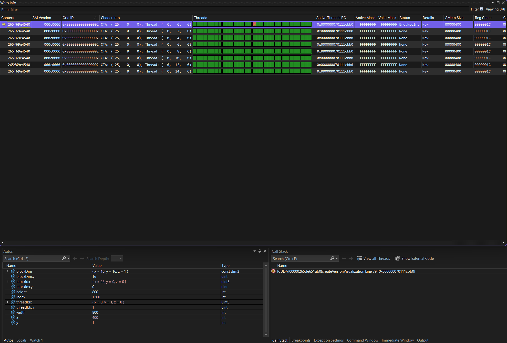
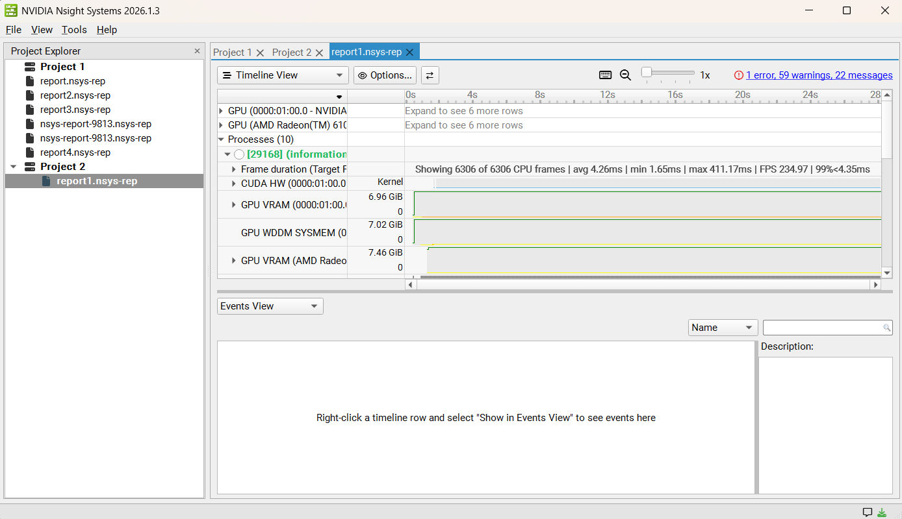
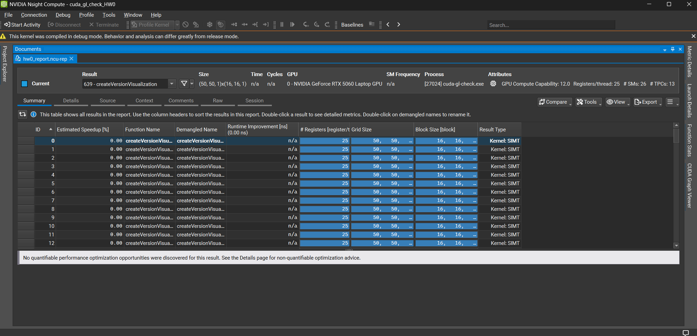
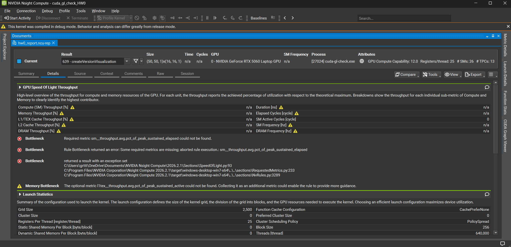
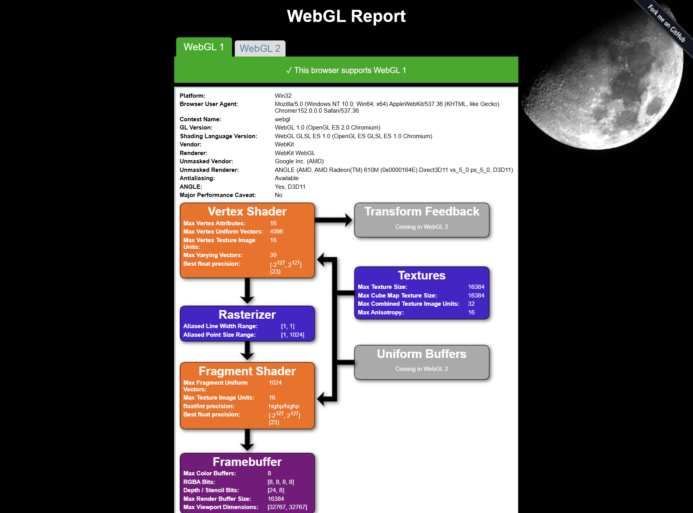

Project 0 Getting Started
====================

**University of Pennsylvania, CIS 5650: GPU Programming and Architecture, Project 0**

* Grace Tan
  * [LinkedIn](https://www.linkedin.com/feed/)
* Tested on: Windows 11 Home 25H2 (Build 26200), AMD Ryzen 9 8945HX @ 2.50GHz, 16GB RAM, NVIDIA GeForce RTX 5060 Laptop GPU 8GB (Personal PC)

### Screenshot of modified CUDA project.

### Screenshot of Nsight Debugging warp info and autos.

### Screenshot of Nsight Systems analysis summary.

### Screenshot of Nsight Compute report summary tab.

### Screenshot of Nsight Compute report details tab.

### Screenshot of WebGL report.
